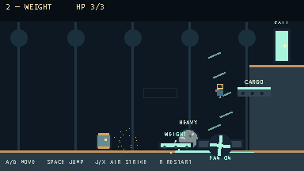
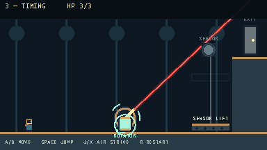
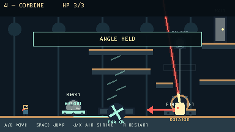
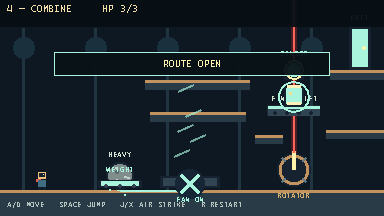

# Final demo report — Can / Useful Danger

## Result and target duration

The default launch is now four distinct single-screen levels: **Redirect**,
**Weight**, **Timing**, and **Combine**. The first-time target is approximately
4–5 minutes: 45–60, 60–75, 75–90, and 90–120 seconds respectively. Those are
design estimates based on decision count and compact travel, not measured human
times. A returning player can skip observation and finish substantially faster.

The player never gains an ability and the Can never gains a behavior. Learning
progresses from direction, to resulting position, to duration, to planning
several future states.

## Level maps and relationships

### 1 — Redirect

```text
START  PLAYER  CAN  [FORCE BLOCK]  [AGAIN BLOCK]  LOCKED EXIT
                 ───── charge lane ────────────────────────>
```

The first leftward lock can harmlessly meet the wall. The player then stands
beyond each broad slide block so the Can locks through it. Two force reactions
light the visible exit circuit. Knowledge learned: **my position controls the
Can's committed line**. The exit stays physically locked until both readable
targets move, so hopping over their low shapes cannot accidentally complete the
room.

### 2 — Weight

```text
                                              [HIGH EXIT]
                                     CARGO  <───────
                                                  │
START  PLAYER  CAN  O BOULDER  [WEIGHT] ─── FAN ↑│
                    └── force ────┘          ↑  ↑│
```

Level 1 positioning is immediately reused to push the Boulder. The Boulder
rolls with understandable horizontal momentum, settles inside a forgiving
button footprint, and supplies generic mass. The held button powers both the
fan and one visible cargo transit. The fan reacts immediately; its accelerating
blades and airflow lift the player to an exit 108 pixels above the floor.

The first major expectation reversal is **fan on does not mean enter without
looking**. The same visible wire moves cargo through the fan column. A quick
first commitment can collide with it; the 0.62-second local retry shows the
same stable transit, so waiting for it to clear is informed rather than rote.

### 3 — Timing

```text
                                      SENSOR ●     [EXIT]
                                            │
                                    [SENSOR LIFT]
                         rotating beam  /
START  PLAYER  CAN  [ROTATOR]  ⟳  LASER
```

Level 1 positioning guides the Can into the rotator. The player can stand
outside its search range while the beam rotates clockwise at 34°/second. Moving
back into range starts the same direction lock learned earlier. When the beam
reaches the sensor, rotation pauses for one second. The sensor turns gold, a
shrinking bar and numeric countdown show the remaining window, and the HUD says
to bait the Can now. Removing the Can during that window freezes the aligned
angle; leaving it in place produces an explicit release message and resumes
rotation. Sustained alignment holds the fast lift up, and the exit remains
locked until the Can has actually left the rotator.

Novices receive a full, visible reaction window instead of needing to predict a
sub-second crossing. Experts can still prepare the Can's departure in advance.
New heuristic: **where the Can stays, and for how long, determines world
state**.

### 4 — Combine

```text
                                             [EXIT]
                                  SENSOR ●        │
                       upper route      │   [FINAL LIFT]
                    ─────────────       │        ↑
                    ─────────────   LASER / ROTATOR
                         FAN ↑             ⟳
START PLAYER  [WEIGHT] O BOULDER  CAN ─────────────
               └──────── circuit ────────────────┘
```

The Can starts to the right of the Boulder. A leftward useful charge pushes the
Boulder onto the button while leaving the Can on the laser side—one action
selects both future positions. The Boulder initially blocks the horizontal
laser, then remains useful as mass rather than as a named “button key.” The
button powers the known fan; the ceiling catches excess launch energy so the
player reaches the upper planning route without skipping to the exit.

The familiar rotator and sensor drive the final vertical platform. A sequential
novice route works. Expert geometry also supports rebounding during the Boulder
charge, selecting which side the Can leaves the rotator, and starting the bait
before alignment.

The final expectation reversal is physical: if the Can is still on the lift
when the sensor activates, the lift carries it into the upper player lane. The
cause remains on screen—beam → sensor → platform → Can position—and the Can then
uses its ordinary locked charge. Preparing its departure before alignment
raises the same platform empty. No actor spawns and no rule changes.

## Knowledge and heuristic transfer

| Level | Required old knowledge | New variable | Reused later |
|---|---|---|---|
| Redirect | move and jump | player position → Can intent | every later bait |
| Weight | choose charge line | force → object endpoint → persistent mass | Boulder, fan, compound states in L4 |
| Timing | charge positioning; persistent states | occupancy duration and telegraph lead | final laser preparation |
| Combine | all previous rules | none; consequences overlap | mastery payoff |

The heuristics build as follows:

1. Stand where the Can should charge.
2. Predict where the struck object will finish.
3. A held physical state remains active until its cause changes.
4. For Can-held mechanisms, timing matters as much as position.
5. Ask what future state an action creates, not only what it solves now.

## Novice and expert play

A novice reacts to the first Can, handles the Boulder and fan sequentially,
overshoots the first laser alignment, and solves the final room one mechanism at
a time. An expert immediately selects lock direction, predicts the broad
Boulder stop, begins the rotator bait before the target angle, rebounds during
useful charges, and prepares the final lift's Can occupancy before the sensor
turns on. The advantage is prediction and fewer state changes, not a new move or
pixel-perfect jump.

## Strategic and systemic influences

- **Into the Breach-style readable intent:** the Can displays a long direction
  arrow, lock cue, and deterministic straight committed line.
- **Hitman-style actor manipulation:** the player controls a predictable actor
  indirectly through where they stand and when they enter its awareness range.
- **BotW-style general properties:** Boulder is movable, heavy, blocking, and
  force-affected; the button reads mass; the beam geometrically tests objects
  and its sensor instead of checking a puzzle flag.
- **Spelunky-style overlap:** a single weight circuit affects fan traversal and
  cargo timing; the final sensor affects both access and Can position; the laser
  can threaten the same upper space it enables.
- **I Wanna-style expectation reversal:** two—not many—visible system
  consequences challenge “use the new opening immediately” without invisible
  hazards, fake exits, or random behavior.
- **Portal-style teach → twist → combine:** direction is isolated, force/weight
  extends it, timing reframes it, and the final room overlaps every known rule.

## Feel and readability pass

- Lock uses the Can's flashing red eye, long arrow, dedicated sound, and text
  confirmation; commit adds a low charge sound and subtle shake.
- Can/Boulder impact transfers momentum, emits stone dust and particles, plays
  a heavy hit, shakes the scene, and uses a brief 35 ms impact pause.
- Buttons visibly depress with no hidden release timer. Fan gameplay responds
  immediately while blade speed visibly accelerates and airflow particles rise.
- The rotator has a physical ring, occupation arcs, smooth beam movement,
  visible endpoint, outlined sensor, activation burst, and hold/release cue.
  Stage 3 adds a gold sensor state, timer bar, numeric countdown, and matching
  HUD message during its one-second action window.
- Platforms show their target ghosts and move quickly at deterministic speeds.
- The HUD is limited to level name, health, controls, and short transient state
  confirmation. Game-facing type uses a larger light-weight monospaced face,
  crisp non-antialiased rendering, and no heavy shadow.
- Death returns to the same room in 0.42 seconds; the cargo reversal in 0.62
  seconds; completion advances in 0.78 seconds. R rebuilds only the current room.

## Communication audit

The previous iteration's communication failures are addressed in the playable
flow rather than delegated to documentation:

- **Unclear idea and theme:** the start screen names the Can as “useful danger,”
  and the four stage titles state the learning arc: Redirect, Weight, Timing,
  Combine.
- **Unclear objective:** every room contains a visible EXIT, moving structures
  show target ghosts, and colored wires remain on screen between causes and
  consequences.
- **Hidden actor intent:** the Can exposes search, direction lock, committed
  charge, impact, and recovery through its arrow, eye, color, motion, sound, and
  short state confirmations.
- **Hidden mechanism state:** labels, depressed buttons, accelerating fan
  blades, beam geometry, sensor color, platform motion, particles, and audio
  all change at the same moment as their gameplay state.
- **Instructions obscuring play:** the large teaching panel exists only before
  control begins. In-level guidance is short, transient, and placed outside
  the play lane.
- **Illegible text:** the native-resolution UI now uses larger, thinner glyphs
  with crisp pixel alignment and no blurred or heavy shadow.
- **Unreasonable Stage 3 timing:** sensor contact visibly holds rotation for one
  second and communicates exactly when the player must remove the Can.

Visual review found and fixed a mastery-layout dead end where Boulder could have
left the Can on the wrong side of the rotator, a final exit that overlapped the
HUD, and unsupported health glyphs. Remaining forced observation is roughly the
2.1-second L3 and 2.65-second L4 beam sweep; both intervals are active planning
time because the player chooses when to enter Can range. Stage 3's sensor pause
turns its former precision interception into a one-second communicated choice.
Walking distances are
under one screen. Critical jumps have broad landings and the final three exits
sit 108, 108, and 60 pixels above their unsolved approach, compared with an
ordinary jump rise of about 42.5 pixels.

## Automated verification

`tests/kinetic.gd` covers requested checks A–O: actual telegraph and lock,
non-tracking commitment, Can-to-Boulder force transfer, deterministic Boulder
direction, real player rebound, generic mass holding a button, fan activation,
lift and release, continuous occupied rotation, frozen unoccupied angle,
geometric sensor alignment, the one-second sensor dwell, cancellation and
angle preservation when the Can leaves during it, platform movement, and the
real Level 2 physical force-to-weight chain.

`tests/kinetic_route.gd` covers P–W: all four fresh room states, visible solved
completion states, explicit unsolved-exit rejection, ordinary-jump height audit,
the complete Level 4 mechanism combination, actual R input, death restart, and
progression retention. State-based completion probes establish logic, not human
execution quality or fun.

Preserved movement, interaction, original-game, and all three Foundry regression
suites remain runnable. The launch scene also passes a headless parse/startup
check.

## Captures

Fifteen native 384×216 captures are stored in
`artifacts/final_demo/screenshots/`:

- L1 telegraph and target impact: `01`–`02`
- L2 Can/Boulder, weight, fan lift, and cargo reversal: `03`–`06`
- L3 occupied rotator, approach, early bait, and active platform: `07`–`10`
- L4 full layout, Boulder blocking, expert chain, carried-Can reversal, and
  victory: `11`–`15`






## Remaining weaknesses

- No independent first-time player has yet confirmed the 4–5 minute target,
  comprehension, enjoyment, sound mix, or preferred strategy.
- Stage 3's “bait the Can away during the gold lock” action is now explicit, but
  its one-second duration may still need tuning after blind playtests.
- The laser/Boulder intersection is geometric rather than full rigid-body ray
  physics, and the Can follows a horizontal service lane.
- Art and audio remain intentionally procedural gray-box assets rather than a
  final authored production set.
- Automated solved-state checks do not prove input-only human completion or fun.

## Changed files

- Design/report: `FINAL_DEMO_DESIGN.md`, `FINAL_DEMO_REPORT.md`
- Main flow: `scripts/kinetic_prototype.gd`
- Core actors: `scripts/enemy.gd`, `scripts/can_boulder.gd`
- Mechanisms: `scripts/can_pressure_switch.gd`, `scripts/can_fan.gd`,
  `scripts/can_laser_rig.gd`, `scripts/can_moving_platform.gd`
- Feedback: `scripts/sfx.gd`
- Tests/captures: `tests/kinetic.gd`, `tests/kinetic_route.gd`,
  `tests/capture_kinetic.gd`, `artifacts/final_demo/screenshots/`
- Player-facing docs: `README.md`, `CHANGELOG.md`
