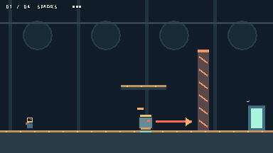
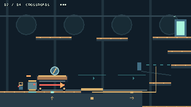
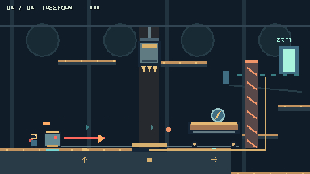
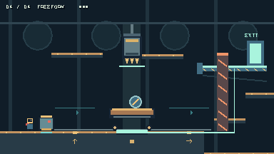
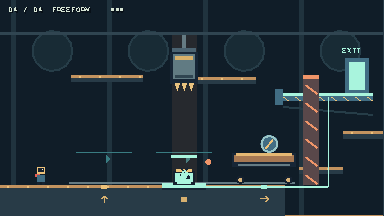

# Foundry / Future States — second redesign

## 1. What was wrong

The audited launch was the first Foundry redesign, committed at `340aed6`.
Eight Cart stops, seven levers, seven blocking mechanisms, elevated release
errands, a 3,600-pixel facility, a long service return and six-second stomp stun
buried good force/state relationships under procedure. Consequences often
mattered off-screen. Mastery largely meant remembering the prescribed order.

Read the requested design/report/README/project/scene, all Foundry scripts,
player, enemy, Cart renderer, mechanisms, switches, Crusher, feedback and tests.
Gameplay was already committed, so no backup commit was needed. Unrelated
`artifacts/blind_playtest/` files were left alone. Original gameplay scripts
remain unchanged and have a runnable `foundry_legacy.tscn` entry point.

## 2. What was removed

From launch: escort/delivery objective, eight-stop railway, seven levers, gate
chains and corridors, service backtracking, NPC catch-up and long ordinary stun.
There are three local Cart positions and no levers or gates. Short freight-door
transitions bring the same actor instances into the next workshop; escorting
them is not a task. Mutations persist within each bay, completed bays stay done,
and R restores the local entry configuration. Historical scenes and changelog
history survive. No new ability or enemy roster was introduced.

## 3. New core loop

**Bait → evade / bounce → committed impact → exploit.**

| Parameter | New behavior |
|---|---|
| Announced direction lock | 0.55 s; no homing after lock |
| Charge | 230 px/s, at most 1.15 s |
| Ordinary stomp | 0.38 s squash/stagger; zero plate mass |
| Charging stomp | preserves direction, speed and remaining duration |
| Can rebound | anchored -305 px/s; automatic descending contact |
| Cart roof rebound | anchored -335 px/s |
| Cart move | reversible 80 px step in 0.4 s |
| Ordinary impact recovery | 0.20 s plus 0.08 s readiness cooldown |
| Environmental grounding | 3.4 s; safe solid shell, mass 2 |
| Forgiveness | existing coyote/buffer; 22×14 stomp query; strong air control |
| Feedback | commit/ground tones, squash, trails, particles, shake, short hit pause |

Fracture does not terminate charge. Cart contact recoils quickly. Continuous
Crusher contact does not refresh grounding every frame; stomping the grounded
shell does not extend its timer. Green X eyes, settled base and shrinking bar
distinguish weight from the active red-eyed force source.

## 4. Why the core can be fun without puzzles

The objective-free `impact_lab.tscn` contains Player, Can, Cart and walls only.
The interesting consequence is immediate: player and robot separate vertically
during one action, then the robot moves a solid roof. Position controls the
result. Predictable launch and fast reuse allow repeated experimentation.

This is a mechanical rationale, not a human-fun verdict. The core fixture was
built and tuned before strategic rooms. It passes actual descending-player
contact during a charge, followed by that same charge's Cart impact. Automated
physics establishes responsiveness; whether someone voluntarily plays in the
lab for two minutes remains a hands-on playtest question.

## 5. Four encounters

1. **Sparks:** one Can, one weak partition and an optional broad perch. Bait,
   dodge/rebound, watch the partition collapse, follow the newly open floor.
   No setup lever precedes the first consequence. The fresh bot leaves after
   2.52 active seconds with a real fracture.
2. **Crossroads:** three positions, high route, plate, low bridge and destination
   fit one screen. A supplies high access; B extends the nearby bridge; C gives
   forward height. Preserve A or change the physical route. Extra pushes recover
   through reversal or the forward roof; high and low paths converge visibly.
3. **The Press:** add one Crusher over the same plate. Cart B both powers the
   bridge and catches the press above Can, preserving force. Cart elsewhere
   exposes environmental conversion: safe shell, weight and step. Forward roof
   traversal remains valid; grounding is optional.
4. **Freeform:** Cart starts at C, off the plate. Reach the visible exit above a
   telescoping support beyond weak orange material. Choose durable Cart weight
   or temporary Can weight and preserve usable height. Fracture creates a low
   passage; upper bypasses also work. The exit needs a physical landing, so
   jumping through empty air cannot finish. No new rule.

## 6. Real strategic tradeoffs

| Action | Benefit | Cost | Recovery | Expert advantage |
|---|---|---|---|---|
| A→B | nearby bridge extends; press is caught | A's high launch moves away | opposite-side charge | use A first or select low support deliberately |
| B→C | forward launch | lasting support and shielding disappear | reverse or replace weight with Can | anticipate support before relocating roof |
| C→B in final | durable exit support | forward roof spent | reverse again | select the upper approach from B |
| Environmental grounding | safe platform and weight | force unavailable for 3.4 s | exploit window or resume at wakeup | stage traversal before committing weight |
| Preserve active Can | movable force | danger; zero plate weight | Cart support or environmental contact | select receiver and ending side before baiting |
| Fracture material | permanent low route | charge relocates Can; support still needed | re-bait from useful side | reduce traversal without needless Cart changes |

There is no universal right-push solution: final C supplies neither plate weight
nor exit support. Temporary weight saves a reversal but spends force; durable
weight frees Can but consumes the forward roof. Press usefulness depends on
that configuration. No surprise death encodes the intended order.

## 7. Novice versus expert

Intended progression: avoid Can → rebound → choose an impact → predict ending
position → convert force to weight → combine support with traversal. Controls
disappear after four seconds. Arrows, roof ghosts, wire, moving bridge and pose
carry the information; no HUD panel explains a solution sequence.

No novice session was measured. A complete high-roof run demonstrates a specific
knowledge benefit: preserve Crossroads A instead of moving it twice. This saves
two Cart impacts and three charges relative to the ordinary Can-weight route.
Speed and unnecessary state changes are reported separately.

## 8. Multiple validated final solutions

**Durable Cart support:** reach C roof, lure searching Can underneath to its far
side, then descend and bait a left charge. C→B supplies permanent bridge weight
and shields the press. Rebound from B to the middle catwalk, jump over the weak
partition and land at the supported exit. Final Cart B; no grounding required.

**Temporary Can support:** keep Cart C. Use its roof to reach the middle catwalk,
move back briefly to lure Can into the press, then exploit the grounded shell's
plate weight and safe step. Use C roof to launch over the partition and land at
the exit before weight releases. Final Cart C; no reversal required.

Both leave the final weak partition intact. These legal upper bypasses were
retained. A fixture also validates an actual Can charge breaking it while B
preserves support. That third force-passage plan has not received a complete
fresh-route script and is not counted as a third validated full solution.

## 9. Full first-time walkthrough

1. **Sparks:** watch the arrow point toward you. After it locks, jump away or
   descend onto the shell. Can continues into the orange partition. Experiment
   with the perch or follow the changed floor through the freight door.
2. **Crossroads:** notice three roof outlines and rail symbols. The current roof
   reaches the high catwalk. A right impact moves it onto a wired plate and
   extends a nearby bridge. Choose either route. Another push loses support but
   creates forward height; reverse or exploit that roof to recover.
3. **The Press:** observe warning and teeth. Cart catches the head; Can under an
   exposed press becomes a green solid shell. Use its step/weight window or
   preserve Cart's support. The shallow trench gives broad recovery steps.
4. **Freeform:** forward roof is ready, exit support retracted. Choose the plate
   occupant: reverse Cart for lasting support or arrange environmental Can
   weight while keeping forward height. Break material for a low approach or
   use the upper route. Land at the exit. R rewinds only this bay if needed.

This describes visible opportunities and recovery, not a measured novice's
observations, learning order or duration.

## 10. Expert walkthrough and metrics

Fracture Sparks with the first useful charge. Preserve A and take Crossroads'
upper path without moving Cart. In The Press, use two forward impacts and the
resulting roof. In Freeform, prepare height before grounding Can, exploit its
step immediately, then launch from C to the supported exit.

| Fresh input-only route | Time¹ | Charges | Cart impacts | Rebounds | Env. stuns | Reversals | Resets / deaths | Idle² |
|---|---:|---:|---:|---:|---:|---:|---:|---:|
| Durable Cart | 18.08 s | 8 | 5 | 4 | 0 | 1 | 0 / 0 | 2.10 s |
| Temporary Can | 18.33 s | 7 | 4 | 5 | 1 | 0 | 0 / 0 | 2.45 s |
| Preserve A + temporary Can | 15.97 s | 4 | 2 | 4 | 1 | 0 | 0 / 0 | 2.08 s |

¹ Simulated time includes three short transitions; human reaction/learning is
not measured. ² Worker nearly stationary, including observation and staging;
not all idle time is forced. Raw metrics and cumulative room states are stored
in `artifacts/second_redesign/route_*.json`.

## 11. Test results

Godot 4.7.2, fixed 60-Hz physics. All following checks passed.

| Requested coverage | Evidence |
|---|---|
| A commitment | move player behind lock; direction unchanged |
| B fast loop | actual impact and Cart move reusable within a second |
| C ordinary stomp | actual strong rebound; 0.38 s stagger; zero weight |
| D environmental state | actual spike overlap and hard-impact conversion |
| E reversal | real swept impacts C→B→A→B→C |
| F multi-role Cart | high access / weight and shield / forward launch |
| G visible consequence | B changes nearby bridge collision immediately |
| H multi-role Can | force versus safe solid shell / plate mass |
| I multiple solutions | two final configurations in complete fresh runs |
| J no right-push dominance | C leaves final landing unsupported |
| K no ordinary long wait | 0.20 s recoil; <0.45 s stagger probe |
| L completion | three complete input-only routes; zero deaths/rewinds |

`second_core.gd`: objective-free tuning and real charging bounce→Cart impact.
`second_systems.gd`: 23 checks, including complete snapshots, pause, actual R
input and <0.4-second death recovery. `second_route.gd`: only move/jump/stomp
after fresh spawn; no actor teleports, force setters or progression writes.

Preserved regressions pass: smoke, original route, interactions, rebound, dash,
kinetic rules/route, Foundry depth/rules, and both legacy fresh routes. Total:
**16 passing runs**, comprising 11 preserved runs plus five new core/system/
route runs. Captured regression logs: `artifacts/second_redesign/regression_results.json`.
Generated audio is wired and plays graphically; subjective listening is untested.

## 12. Screenshots / visual check

Native Godot captures inspected individually. Each arena keeps Can/state, Cart
positions, hazard, physical mechanism, route and destination in the original
384×216 viewport. Fixed invisible frozen worker rendering and replaced
font-dependent position symbols with drawn glyphs. State captures are staged;
they are separate from fresh-route completion evidence.

Reproduce with `tests/capture_second.gd` and a graphics renderer.

## 13. Files changed

| Files | Purpose |
|---|---|
| `project.godot`, `scenes/foundry.tscn` | launch and identity |
| `scenes/foundry_legacy.tscn`, `scenes/impact_lab.tscn` | preserved build / objective-free lab |
| `scripts/action_foundry.gd` | four bays, geometry, actor reuse, feedback, metrics, UI and rewind |
| `scripts/action_can.gd`, `scripts/action_player.gd` | continued charging rebound, fast reuse, weight / safe platform |
| `scripts/action_cart.gd` | three fast reversible positions and flywheel roof art |
| `scripts/action_crusher.gd`, `scripts/action_mechanism.gd` | shared press/shield and telescoping bridge |
| `tests/second_core.gd`, `second_systems.gd`, `second_route.gd`, `capture_second.gd` | new tests and captures |
| `tests/foundry_rules.gd`, `foundry_route.gd`, `capture_foundry.gd` | historical checks use historical scene |
| `README.md`, both `SECOND_REDESIGN_*.md`, `CHANGELOG.md` | design, instructions, evidence and preserved history |
| `artifacts/second_redesign/` | three metric files, regression logs, six captures |

Godot-generated script `.uid` and screenshot `.import` sidecars accompany the
new resources. Editor import also passes without script errors.

## 14. Remaining weaknesses

- **Fun is not human-validated.** Responsiveness/feedback pass; voluntary replay
  and intuitive discovery still need independent play.
- **6–8 minutes is unverified and may be optimistic.** Experts finish in 16–18
  seconds. This is a compressed four-room prototype, not evidence of six minutes
  of first-time learning. No filler was added to manufacture the target.
- **Upper bypasses are strong.** Both full solutions skip the final fracture.
  That is legal emergence; the complete low force route needs validation before
  claiming equal strategic value for breaking and jumping the partition.
- **Compact depth:** shared visual grammar and routes may reveal a preferred
  approach in longer play. Right-push failure does not prove absence of every
  possible dominant strategy.
- **Scoped physics:** Can follows a fixed-height maintenance lane, Cart fixed
  stops, and actors are rehomed between bays. No general 2D robot navigation or
  persistent whole-facility simulation is claimed.
- **Prototype presentation:** procedural art/audio remain. Tiny actors, color
  distinctions, press contact and temporary weight need human readability,
  accessibility and listening checks. Hardware gamepad play was not exercised.
